# Selenium to Playwright Converter (AI-Powered) 🚀

A modern tool to convert legacy **Selenium (Java)** automation scripts into **Playwright (TypeScript/JavaScript)** using **Local LLMs (Ollama)**.

## 🏗️ Architecture

The system follows the **B.L.A.S.T.** protocol and uses a 3-layer architecture:

```mermaid
graph TD
    User["👩‍💻 User"] -->|Pastes Java Code| UI["React Frontend (Vite)"]
    UI -->|POST /api/convert| API["Express Backend (Node.js)"]
    
    subgraph AI_Layer ["AI Link Layer"]
        API -->|Prompt + Code| LLM["Ollama (Local LLM)"]
        LLM -->|Playwright TS Code| API
    end
    
    API -->|JSON Response| UI
    UI -->|Displays Code| User
```



## ✨ Features

- **AI-Powered Conversion**: Uses `codellama` to understand logic, not just regex replacement.
- **Smart Mappings**: Converts `driver.findElement` to `page.locator`, assertions to `expect()`, etc.
- **Modern UI**: Dark-mode enabled React interface.
- **Local & Private**: No code leaves your machine; it runs 100% locally via Ollama.

## 🚀 Getting Started

### Prerequisites

1.  **Node.js** (v18+)
2.  **Ollama**: [Download Here](https://ollama.ai/)
3.  **CodeLlama Model**: Run `ollama pull codellama`

### Installation

1.  **Clone the Repository**
    ```bash
    git clone https://github.com/nagarjunabhr8/Convert-Selenium-Java-Code-to-TypeScript-JavaScript.git
    cd Convert-Selenium-Java-Code-to-TypeScript-JavaScript
    ```

2.  **Setup Backend**
    ```bash
    cd backend
    npm install
    # Start the server (Port 3001)
    npx ts-node server.ts
    ```

3.  **Setup Frontend** (Open a new terminal)
    ```bash
    cd frontend
    npm install
    # Start the UI (Port 5173)
    npm run dev
    ```

## 🛠️ Tech Stack

- **Frontend**: React, Vite, TypeScript
- **Backend**: Node.js, Express, TypeScript
- **AI**: Ollama (`codellama` model)

## 🤝 Contribution

Feel free to submit Pull Requests to improve the prompt engineering or UI!
